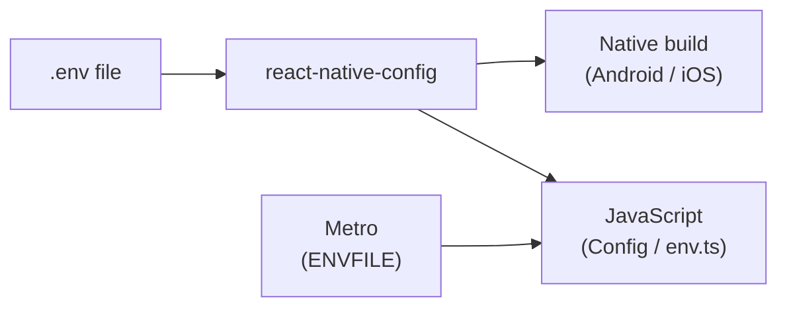

# ReactNativeEnvironmentFlavours
This includes detailed guide how to setup flavours to react native cli project


# Multi-environment setup (Dev · Staging · Production)

A guide for running and configuring **multiple environments** in this React Native app on **Android** and **iOS**.

---

## Quick start

**1. Create your env files** (not in git — get values from your team):

```
.env              → development
.env.staging      → staging
.env.production   → production
```

**2. Open two terminals and pick one environment:**

| Environment | Terminal 1 (Metro) | Terminal 2 (run app) |
|-------------|-------------------|----------------------|
| Dev | `yarn start:dev` | `yarn android:dev` or `yarn ios:dev` |
| Staging | `yarn start:staging` | `yarn android:staging` or `yarn ios:staging` |
| Production | `yarn start:prod` | `yarn android:prod` or `yarn ios:prod` |

**Rule:** Metro and the native app must use the **same** environment.  
✅ `start:staging` + `android:staging`  
❌ `start:dev` + `android:staging`

---

## What problem does this solve?

Without flavors/schemes, switching API URLs means editing `.env` by hand and rebuilding. This setup lets you:

- Point each build at a different backend (dev / staging / prod)
- Show a different **app name** on the home screen (e.g. “MyApp Staging”)
- Ship **one codebase** with separate store release configs

### Building blocks

| Piece | Platform | What it does |
|-------|----------|--------------|
| `.env` files | Both | Hold API URLs, keys, feature flags |
| [`react-native-config`](https://github.com/lugg/react-native-config) | Both | Injects env vars into native + JS at build time |
| **Product flavors** | Android | `dev`, `staging`, `prod` build variants |
| **Xcode schemes** | iOS | `App-Dev`, `App-Staging`, `App-Prod` |
| **Yarn scripts** | Both | Wire Metro + native build to the right env |

### How data flows



1. You pick an environment (e.g. staging).
2. Metro bundles JS using that `.env` file.
3. The native build loads the same `.env` via `react-native-config`.
4. Your app reads values through `src/config/env.ts`.

---

## Environment cheat sheet

### This project

| Environment | Env file | App name | Android flavor | iOS scheme |
|-------------|----------|----------|----------------|------------|
| Dev | `.env` | RabbitHole Dev | `dev` | `Test-Dev` |
| Staging | `.env.staging` | RabbitHole Staging | `staging` | `Test-Staging` |
| Production | `.env.production` | RabbitHole | `prod` | `Test-Prod` |

### Android build variants

A **variant** = flavor + build type:

```
flavor   +  build type  =  variant
dev      +  debug        =  devDebug
staging  +  debug        =  stagingDebug
prod     +  release      =  prodRelease   ← Play Store
```

### All yarn scripts

| Script | Loads | Android variant | iOS scheme |
|--------|-------|-----------------|------------|
| `yarn start:dev` | `.env` | — | — |
| `yarn android:dev` | `.env` | `devDebug` | — |
| `yarn ios:dev` | `.env` | — | `Test-Dev` |
| `yarn start:staging` | `.env.staging` | — | — |
| `yarn android:staging` | `.env.staging` | `stagingDebug` | — |
| `yarn ios:staging` | `.env.staging` | — | `Test-Staging` |
| `yarn start:prod` | `.env.production` | — | — |
| `yarn android:prod` | `.env.production` | `prodDebug` | — |
| `yarn ios:prod` | `.env.production` | — | `Test-Prod` |
| `yarn android:prod:release` | `.env.production` | `prodRelease` (APK) | — |
| `yarn android:prod:aab` | `.env.production` | `prodRelease` (AAB) | — |

---

## Environment files

Create these in the **project root**. They are gitignored — never commit secrets.

| File | Set `APP_ENV` to | Used for |
|------|------------------|----------|
| `.env` | `development` | Local development |
| `.env.staging` | `staging` | QA / staging server |
| `.env.production` | `production` | App Store / Play Store |

**Example `.env`:**

```dotenv
APP_ENV=development
API_URL=https://api-dev.example.com/
SOCKET_URL=https://api-dev.example.com/chat

# Add other keys your app needs (analytics, payments, etc.)
SENTRY_DSN=
POSTHOG_API_KEY=
```

> After changing any `.env` file, **rebuild the native app**. Values are baked in at build time, not read live.

### Read values in code

Prefer typed helpers in `src/config/env.ts`:

```ts
import { getApiBaseUrl, getAppEnv } from '@/config/env';

const baseUrl = getApiBaseUrl();
const env = getAppEnv(); // 'development' | 'staging' | 'production'
```

Add new keys to `src/types/react-native-config.d.ts` for TypeScript.

---

## Android setup

Android uses **product flavors** in `android/app/build.gradle`.

### Step 1 — Map each variant to an env file

Add **before** `dotenv.gradle` is applied:

```gradle
project.ext.envConfigFiles = [
  devDebug:       ".env",
  devRelease:     ".env",
  stagingDebug:   ".env.staging",
  stagingRelease: ".env.staging",
  prodDebug:      ".env.production",
  prodRelease:    ".env.production",
]

apply from: project(':react-native-config').projectDir.getPath() + "/dotenv.gradle"
```

### Step 2 — Define flavors

```gradle
flavorDimensions "env"

productFlavors {
  dev {
    dimension "env"
    versionNameSuffix "-dev"
    resValue "string", "app_name", "MyApp Dev"      // home screen name
  }
  staging {
    dimension "env"
    versionNameSuffix "-staging"
    resValue "string", "app_name", "MyApp Staging"
  }
  prod {
    dimension "env"
    resValue "string", "app_name", "MyApp"
  }
}
```

`app_name` is used by `AndroidManifest.xml` via `android:label="@string/app_name"`.

### Step 3 — Enable Metro for debug flavors

Inside the `react { }` block:

```gradle
debuggableVariants = ["devDebug", "stagingDebug", "prodDebug"]
```

Skip this and Metro won't attach to flavored debug builds.

### Step 4 — Add run scripts to `package.json`

```json
"android:dev":     "ENVFILE=.env react-native run-android --mode=devDebug",
"android:staging": "ENVFILE=.env.staging react-native run-android --mode=stagingDebug",
"android:prod":    "ENVFILE=.env.production react-native run-android --mode=prodDebug"
```

> Variant names are **camelCase**: `devDebug`, not `dev-debug`.

### Store releases

```sh
yarn android:prod:release   # APK  → android/app/build/outputs/apk/prod/release/
yarn android:prod:aab       # AAB  → android/app/build/outputs/bundle/prodRelease/
```

---

## iOS setup

iOS uses **Xcode schemes**. Each scheme runs a script before build to pick the right `.env` file.

### Step 1 — xcconfig files

Create `ios/Config/Debug.xcconfig` and `Release.xcconfig`:

```
#include "../Pods/Target Support Files/Pods-<YourApp>/Pods-<YourApp>.debug.xcconfig"
#include? "../tmp.xcconfig"
```

(`tmp.xcconfig` is generated at build time — do not commit it.)

Point your app target's Debug / Release configurations to these files in Xcode.

### Step 2 — Environment script

`ios/scripts/set-env-file.sh` runs before each build. It:

1. Tells `react-native-config` which `.env` file to use
2. Generates `ios/tmp.xcconfig` with env variables
3. Sets the app display name on the home screen

### Step 3 — Create one scheme per environment

Duplicate your main scheme three times and add a **Build Pre-action** to each:

**Xcode → Product → Scheme → Edit Scheme → Build → Pre-actions → +**

| Scheme | Pre-action command |
|--------|-------------------|
| `App-Dev` | `"${SRCROOT}/scripts/set-env-file.sh" ".env"` |
| `App-Staging` | `"${SRCROOT}/scripts/set-env-file.sh" ".env.staging"` |
| `App-Prod` | `"${SRCROOT}/scripts/set-env-file.sh" ".env.production"` |

Check **“Provide build settings from”** → select your app target.

Save schemes under `xcshareddata/xcschemes/` so they are committed to git (**Manage Schemes → Shared**).

### Step 4 — Add run scripts to `package.json`

```json
"ios:dev":     "ENVFILE=.env react-native run-ios --scheme App-Dev",
"ios:staging": "ENVFILE=.env.staging react-native run-ios --scheme App-Staging",
"ios:prod":    "ENVFILE=.env.production react-native run-ios --scheme App-Prod --mode Release"
```

### App Store / TestFlight

1. Open `ios/<YourApp>.xcworkspace` in Xcode
2. Select the **production** scheme
3. **Product → Archive**

---

## Store releases (summary)

| Platform | Command / action | Output |
|----------|------------------|--------|
| Android APK | `yarn android:prod:release` | `android/app/build/outputs/apk/prod/release/` |
| Android AAB | `yarn android:prod:aab` | `android/app/build/outputs/bundle/prodRelease/` |
| iOS | Xcode → Prod scheme → Archive | TestFlight / App Store |

`android:prod` and `ios:prod` are for **testing** production config locally — not for store submission.

---

## Add a new environment

Example: add **QA**.

| Step | Android | iOS |
|------|---------|-----|
| 1 | Create `.env.qa` | Same file |
| 2 | Add `qaDebug` / `qaRelease` to `envConfigFiles` | Duplicate a scheme → `App-QA` |
| 3 | Add `qa` flavor in `productFlavors` | Pre-action: `set-env-file.sh ".env.qa"` |
| 4 | Add `qaDebug` to `debuggableVariants` | Add display name in `set-env-file.sh` |
| 5 | Add `start:qa`, `android:qa`, `ios:qa` scripts | — |

### Install multiple environments side-by-side

By default, all flavors share one bundle ID — only one can be installed at a time.

To install dev + staging together:

- **Android:** add `applicationIdSuffix ".dev"` (etc.) per flavor
- **iOS:** use different `PRODUCT_BUNDLE_IDENTIFIER` per scheme

---

## Troubleshooting

| Problem | Fix |
|---------|-----|
| Wrong API URL at runtime | Metro and native build use different envs. Restart Metro with matching `yarn start:*`. |
| Env change not applied | Rebuild the native app after editing `.env`. |
| Android: variant not found | Use camelCase: `--mode=stagingDebug`, not `staging-debug`. |
| Android: Metro won't connect | Add your debug variant to `debuggableVariants` in `build.gradle`. |
| iOS: wrong app name | Clean build (⇧⌘K). Check scheme pre-action points to correct `.env`. |
| iOS: scheme missing in CI | Scheme must be in `xcshareddata/xcschemes/` and marked Shared. |
| Android: empty `Config` values | `envConfigFiles` must be declared **before** `dotenv.gradle`. |

---

## Project file map

| File | Purpose |
|------|---------|
| `.env`, `.env.staging`, `.env.production` | Secrets & config (gitignored) |
| `package.json` | `start:*`, `android:*`, `ios:*` scripts |
| `android/app/build.gradle` | Flavors, env mapping, debuggable variants |
| `android/app/src/main/AndroidManifest.xml` | `android:label="@string/app_name"` |
| `ios/Config/Debug.xcconfig` | Debug base config |
| `ios/Config/Release.xcconfig` | Release base config |
| `ios/scripts/set-env-file.sh` | Picks env file per scheme |
| `ios/<App>.xcodeproj/xcshareddata/xcschemes/` | Shared schemes (in git) |
| `src/config/env.ts` | Typed JS access to env vars |
| `src/types/react-native-config.d.ts` | TypeScript types for env keys |

---

## This project's identifiers

| | Value |
|---|-------|
| Android package | `com.test` |
| iOS bundle ID | `org.app.ios.Test` |
| iOS workspace | `ios/Test.xcworkspace` |

All environments currently share these IDs. See [Add a new environment](#add-a-new-environment) to install multiple builds on one device.


______

#flavoursInReactNative #multienviromentreactnative  #reactnativeconfig #schemesInReactNative #schemesreactnative
